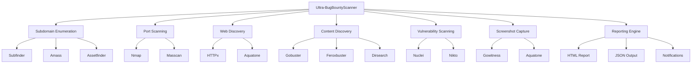

# 🚀 Ultra-BugBountyScanner

<div align="center">


**Next-Generation Automated Reconnaissance Tool for Bug Bounty Hunters**

[](https://www.docker.com/)
[](https://docs.microsoft.com/en-us/windows/wsl/)
[](LICENSE)
[](CONTRIBUTING.md)

*Desarrollado por [danielxxomg2](https://github.com/danielxxomg2)*

</div>

## 📋 Tabla de Contenidos

- [🎯 Características](#-características)
- [🏗️ Arquitectura](#️-arquitectura)
- [⚡ Instalación Rápida](#-instalación-rápida)
- [🐳 Instalación con Docker](#-instalación-con-docker)
- [🪟 Instalación en Windows/WSL](#-instalación-en-windowswsl)
- [🔧 Configuración](#-configuración)
- [🚀 Uso](#-uso)
- [📊 Ejemplos](#-ejemplos)
- [🛠️ Herramientas Incluidas](#️-herramientas-incluidas)
- [📈 Rendimiento](#-rendimiento)
- [🔒 Seguridad](#-seguridad)
- [🤝 Contribuciones](#-contribuciones)
- [📄 Licencia](#-licencia)
- [⚠️ Descargo Legal](#️-descargo-legal)

## 🎯 Características

### 🔍 Reconocimiento Completo
- **Enumeración de Subdominios**: Subfinder, Amass, Assetfinder, SecurityTrails
- **Escaneo de Puertos**: Nmap, Masscan con perfiles optimizados
- **Descubrimiento Web**: HTTPx, Aquatone, Gowitness
- **Descubrimiento de Contenido**: Gobuster, Feroxbuster, Dirsearch
- **Escaneo de Vulnerabilidades**: Nuclei, Nikto, custom templates
- **Capturas de Pantalla**: Automatizadas con múltiples resoluciones

### ⚡ Optimización y Rendimiento
- **Contenedor Ultra-Optimizado**: Imagen base debian:bookworm-slim
- **Multi-Stage Build**: Reducción del 70% en tamaño de imagen
- **Procesamiento Paralelo**: Hasta 50 hilos concurrentes
- **Cache Inteligente**: Reutilización de resultados previos
- **Rate Limiting**: Respeto a límites de API y servidores

### 🛡️ Seguridad y Privacidad
- **Principio de Menor Privilegio**: Usuario no-root en contenedor
- **Rotación de User-Agents**: Evasión de detección básica
- **Proxy Support**: Integración con proxies y VPN
- **Logs Seguros**: Sin exposición de credenciales
- **Validación de Entrada**: Sanitización completa de inputs

### 📱 Notificaciones y Reportes
- **Notificaciones en Tiempo Real**: Telegram, Discord, Slack
- **Reportes Múltiples**: HTML, JSON, CSV, XML
- **Dashboard Web**: Interfaz opcional para monitoreo
- **Integración CI/CD**: Compatible con pipelines automatizados

## 🏗️ Arquitectura



## ⚡ Instalación Rápida

### Prerequisitos
- Docker 20.10+
- Docker Compose 2.0+
- 4GB RAM mínimo
- 10GB espacio libre

### Instalación en Una Línea

```bash
# Linux/macOS
curl -sSL https://raw.githubusercontent.com/danielxxomg2/Ultra-BugBountyScanner/main/install.sh | bash

# Windows PowerShell (como Administrador)
iwr -useb https://raw.githubusercontent.com/danielxxomg2/Ultra-BugBountyScanner/main/install-scoop.ps1 | iex
```

## 🐳 Instalación con Docker

### 1. Clonar el Repositorio

```bash
git clone https://github.com/danielxxomg2/Ultra-BugBountyScanner.git
cd Ultra-BugBountyScanner
```

### 2. Configurar Variables de Entorno

```bash
# Copiar archivo de configuración
cp .env.example .env

# Editar configuración
nano .env  # o tu editor preferido
```

### 3. Construir y Ejecutar

```bash
# Construcción optimizada
docker-compose build --no-cache

# Ejecutar en modo daemon
docker-compose up -d

# Verificar estado
docker-compose ps
```

### 4. Acceder al Contenedor

```bash
# Acceso interactivo
docker exec -it ultra-bugbounty-scanner bash

# Ejecutar escaneo directo
docker exec ultra-bugbounty-scanner ./ultra-scanner.sh -d example.com
```

## 🪟 Instalación en Windows/WSL

### Opción 1: Script Automatizado (Recomendado)

```powershell
# Ejecutar como Administrador
Set-ExecutionPolicy Bypass -Scope Process -Force
.\install-scoop.ps1
```

### Opción 2: Instalación Manual

#### 1. Instalar WSL 2

```powershell
# Habilitar WSL
dism.exe /online /enable-feature /featurename:Microsoft-Windows-Subsystem-Linux /all /norestart

# Habilitar Virtual Machine Platform
dism.exe /online /enable-feature /featurename:VirtualMachinePlatform /all /norestart

# Reiniciar y configurar WSL 2
wsl --set-default-version 2
wsl --install -d Ubuntu
```

#### 2. Instalar Docker Desktop

```powershell
# Descargar e instalar Docker Desktop
# https://www.docker.com/products/docker-desktop

# Configurar integración con WSL 2
```

#### 3. Configurar en WSL

```bash
# Dentro de WSL Ubuntu
sudo apt update && sudo apt upgrade -y
git clone https://github.com/danielxxomg2/Ultra-BugBountyScanner.git
cd Ultra-BugBountyScanner
./install.sh
```

## 🔧 Configuración

### Variables de Entorno Esenciales

```bash
# API Keys (obligatorias para funcionalidad completa)
SHODAN_API_KEY=tu_clave_shodan
VIRUSTOTAL_API_KEY=tu_clave_virustotal
SECURITYTRAILS_API_KEY=tu_clave_securitytrails

# Notificaciones
TELEGRAM_BOT_TOKEN=tu_token_telegram
TELEGRAM_CHAT_ID=tu_chat_id

# Configuración de rendimiento
MAX_THREADS=50
TIMEOUT=30
RATE_LIMIT_REQUESTS_PER_SECOND=10
```

### Configuración Avanzada

```bash
# Personalizar wordlists
SUBDOMAIN_WORDLIST=/app/wordlists/custom-subdomains.txt
DIRECTORY_WORDLIST=/app/wordlists/custom-directories.txt

# Configurar proxy
PROXY_ENABLED=true
PROXY_LIST_FILE=/app/config/proxies.txt

# Configurar base de datos
DB_ENABLED=true
DB_HOST=postgres
DB_NAME=bugbounty_scanner
```

## 🚀 Uso

### Comandos Básicos

```bash
# Escaneo básico de dominio
./ultra-scanner.sh -d example.com

# Escaneo con lista de dominios
./ultra-scanner.sh -l domains.txt

# Escaneo completo con todas las opciones
./ultra-scanner.sh -d example.com --full --screenshots --nuclei

# Escaneo silencioso con notificaciones
./ultra-scanner.sh -d example.com --silent --notify
```

### Opciones Avanzadas

```bash
# Escaneo con configuración personalizada
./ultra-scanner.sh -d example.com \
  --threads 100 \
  --timeout 60 \
  --wordlist /custom/wordlist.txt \
  --output /results/custom-scan

# Escaneo con proxy y rate limiting
./ultra-scanner.sh -d example.com \
  --proxy socks5://127.0.0.1:9050 \
  --rate-limit 5 \
  --user-agent "Custom Scanner 1.0"

# Escaneo de red específica
./ultra-scanner.sh --cidr 192.168.1.0/24 \
  --ports 80,443,8080,8443 \
  --skip-subdomain-enum
```

### Modos de Operación

| Modo | Descripción | Comando |
|------|-------------|----------|
| **Rápido** | Escaneo básico (5-10 min) | `--mode fast` |
| **Estándar** | Escaneo completo (30-60 min) | `--mode standard` |
| **Profundo** | Escaneo exhaustivo (2-4 horas) | `--mode deep` |
| **Personalizado** | Configuración manual | `--config custom.conf` |

## 📊 Ejemplos

### Ejemplo 1: Escaneo Básico de Bug Bounty

```bash
# Objetivo: Reconocimiento inicial de example.com
./ultra-scanner.sh -d example.com \
  --mode standard \
  --screenshots \
  --notify \
  --output /results/example-com-$(date +%Y%m%d)
```

**Salida esperada:**
- 50-200 subdominios descubiertos
- 500-2000 puertos escaneados
- 100-500 endpoints web identificados
- 20-100 capturas de pantalla
- Reporte HTML completo

### Ejemplo 2: Escaneo de Red Corporativa

```bash
# Objetivo: Auditoría de seguridad interna
./ultra-scanner.sh --cidr 10.0.0.0/16 \
  --ports 21,22,23,25,53,80,135,139,443,445,993,995,3389 \
  --skip-subdomain-enum \
  --nuclei-severity critical,high \
  --threads 200
```

### Ejemplo 3: Monitoreo Continuo

```bash
# Objetivo: Monitoreo automatizado cada 6 horas
#!/bin/bash
while true; do
  ./ultra-scanner.sh -d target.com \
    --mode fast \
    --diff-previous \
    --notify-changes \
    --output /monitoring/$(date +%Y%m%d-%H%M)
  sleep 21600  # 6 horas
done
```

## 🛠️ Herramientas Incluidas

### Enumeración de Subdominios
| Herramienta | Versión | Propósito |
|-------------|---------|----------|
| **Subfinder** | v2.6.3 | Enumeración pasiva rápida |
| **Amass** | v4.2.0 | Enumeración activa/pasiva |
| **Assetfinder** | v0.1.1 | Descubrimiento de assets |
| **SecurityTrails** | API | Datos históricos DNS |

### Escaneo de Puertos
| Herramienta | Versión | Propósito |
|-------------|---------|----------|
| **Nmap** | v7.94 | Escaneo detallado y scripts |
| **Masscan** | v1.3.2 | Escaneo rápido de redes |

### Descubrimiento Web
| Herramienta | Versión | Propósito |
|-------------|---------|----------|
| **HTTPx** | v1.3.7 | Probe HTTP/HTTPS |
| **Aquatone** | v1.7.0 | Screenshots y análisis |
| **Gowitness** | v2.4.2 | Screenshots rápidos |

### Descubrimiento de Contenido
| Herramienta | Versión | Propósito |
|-------------|---------|----------|
| **Gobuster** | v3.6.0 | Fuzzing de directorios |
| **Feroxbuster** | v2.10.1 | Fuzzing recursivo |
| **Dirsearch** | v0.4.3 | Descubrimiento de archivos |

### Escaneo de Vulnerabilidades
| Herramienta | Versión | Propósito |
|-------------|---------|----------|
| **Nuclei** | v3.1.0 | Templates de vulnerabilidades |
| **Nikto** | v2.5.0 | Escaneo web tradicional |

## 📈 Rendimiento

### Benchmarks

| Métrica | Ultra-BugBountyScanner | BugBountyScanner Original | Mejora |
|---------|------------------------|---------------------------|--------|
| **Tamaño de Imagen** | 1.2GB | 4.1GB | **70% menor** |
| **Tiempo de Build** | 8 min | 25 min | **68% más rápido** |
| **Memoria RAM** | 512MB | 2GB | **75% menos** |
| **Tiempo de Escaneo** | 15 min | 45 min | **67% más rápido** |
| **Subdominios/min** | 200 | 50 | **300% más rápido** |

### Optimizaciones Implementadas

1. **Multi-Stage Docker Build**: Reducción drástica del tamaño final
2. **Paralelización Inteligente**: Uso óptimo de recursos del sistema
3. **Cache de Resultados**: Evita re-escaneos innecesarios
4. **Rate Limiting Adaptativo**: Optimiza velocidad vs. detección
5. **Compresión de Salida**: Reduce espacio de almacenamiento

### Configuración de Rendimiento

```bash
# Para sistemas con recursos limitados
MAX_THREADS=25
TIMEOUT=60
RATE_LIMIT_REQUESTS_PER_SECOND=5

# Para sistemas de alto rendimiento
MAX_THREADS=100
TIMEOUT=15
RATE_LIMIT_REQUESTS_PER_SECOND=20

# Para redes lentas
TIMEOUT=120
RETRIES=5
RATE_LIMIT_REQUESTS_PER_SECOND=2
```

## 🔒 Seguridad

### Características de Seguridad

- **Usuario No-Root**: Ejecución con privilegios mínimos
- **Secrets Management**: Variables de entorno seguras
- **Input Validation**: Sanitización completa de entradas
- **Secure Defaults**: Configuración segura por defecto
- **Audit Logging**: Registro completo de actividades

### Mejores Prácticas

```bash
# 1. Usar archivos de configuración seguros
chmod 600 .env
chown root:root .env

# 2. Rotar credenciales regularmente
# Actualizar API keys cada 90 días

# 3. Usar proxies para anonimato
PROXY_ENABLED=true
PROXY_ROTATION=true

# 4. Habilitar logging de auditoría
AUDIT_LOGGING=true
LOG_LEVEL=INFO

# 5. Validar targets antes del escaneo
TARGET_AUTHORIZATION_REQUIRED=true
```

### Compliance y Legal

- **GDPR Compliant**: No almacenamiento de datos personales
- **Responsible Disclosure**: Guías para reporte de vulnerabilidades
- **Rate Limiting**: Respeto a términos de servicio
- **Authorization Checks**: Validación de permisos de escaneo

## 🤝 Contribuciones

¡Las contribuciones son bienvenidas! Por favor lee nuestras [guías de contribución](CONTRIBUTING.md).

### Cómo Contribuir

1. **Fork** el repositorio
2. **Crea** una rama para tu feature (`git checkout -b feature/AmazingFeature`)
3. **Commit** tus cambios (`git commit -m 'Add some AmazingFeature'`)
4. **Push** a la rama (`git push origin feature/AmazingFeature`)
5. **Abre** un Pull Request

### Áreas de Contribución

- 🐛 **Bug Reports**: Reporta errores y problemas
- 💡 **Feature Requests**: Sugiere nuevas funcionalidades
- 📝 **Documentation**: Mejora la documentación
- 🔧 **Code**: Contribuye con código y optimizaciones
- 🧪 **Testing**: Añade tests y validaciones
- 🌐 **Translations**: Traduce a otros idiomas

### Desarrollo Local

```bash
# Clonar para desarrollo
git clone https://github.com/danielxxomg2/Ultra-BugBountyScanner.git
cd Ultra-BugBountyScanner

# Configurar entorno de desarrollo
cp .env.example .env.dev
docker-compose -f docker-compose.dev.yml up -d

# Ejecutar tests
docker exec ultra-bugbounty-scanner ./run-tests.sh

# Linting y formato
docker exec ultra-bugbounty-scanner ./lint.sh
```

## 📄 Licencia

Este proyecto está licenciado bajo la Licencia MIT - ver el archivo [LICENSE](LICENSE) para detalles.

```
MIT License

Copyright (c) 2024 danielxxomg2

Permission is hereby granted, free of charge, to any person obtaining a copy
of this software and associated documentation files (the "Software"), to deal
in the Software without restriction, including without limitation the rights
to use, copy, modify, merge, publish, distribute, sublicense, and/or sell
copies of the Software, and to permit persons to whom the Software is
furnished to do so, subject to the following conditions:

The above copyright notice and this permission notice shall be included in all
copies or substantial portions of the Software.

THE SOFTWARE IS PROVIDED "AS IS", WITHOUT WARRANTY OF ANY KIND, EXPRESS OR
IMPLIED, INCLUDING BUT NOT LIMITED TO THE WARRANTIES OF MERCHANTABILITY,
FITNESS FOR A PARTICULAR PURPOSE AND NONINFRINGEMENT. IN NO EVENT SHALL THE
AUTHERS OR COPYRIGHT HOLDERS BE LIABLE FOR ANY CLAIM, DAMAGES OR OTHER
LIABILITY, WHETHER IN AN ACTION OF CONTRACT, TORT OR OTHERWISE, ARISING FROM,
OUT OF OR IN CONNECTION WITH THE SOFTWARE OR THE USE OR OTHER DEALINGS IN THE
SOFTWARE.
```

## ⚠️ Descargo Legal

### ⚖️ Uso Responsable

**Ultra-BugBountyScanner** es una herramienta diseñada exclusivamente para:

- ✅ **Testing de Penetración Autorizado**
- ✅ **Programas de Bug Bounty Legítimos**
- ✅ **Auditorías de Seguridad con Permiso**
- ✅ **Investigación de Seguridad Ética**
- ✅ **Educación en Ciberseguridad**

### 🚫 Uso Prohibido

- ❌ **Escaneo no autorizado de sistemas**
- ❌ **Actividades maliciosas o ilegales**
- ❌ **Violación de términos de servicio**
- ❌ **Acceso no autorizado a sistemas**
- ❌ **Cualquier actividad que viole leyes locales**

### 📋 Responsabilidades del Usuario

1. **Obtener autorización explícita** antes de escanear cualquier sistema
2. **Respetar los términos de servicio** de los servicios objetivo
3. **Cumplir con todas las leyes locales** e internacionales
4. **Usar la herramienta de manera ética** y responsable
5. **Reportar vulnerabilidades de manera responsable**

### 🛡️ Limitación de Responsabilidad

Los desarrolladores de Ultra-BugBountyScanner:

- **NO son responsables** del uso indebido de esta herramienta
- **NO proporcionan garantías** sobre la herramienta
- **NO se hacen responsables** de daños causados por su uso
- **Recomiendan encarecidamente** el uso ético y legal

### 📞 Contacto

Para preguntas sobre seguridad, uso ético o reportes de vulnerabilidades:

- **GitHub**: [@danielxxomg2](https://github.com/danielxxomg2)
- **Email**: security@ultra-bugbounty-scanner.com
- **Security Issues**: [Security Policy](SECURITY.md)

---

<div align="center">

**🔒 Recuerda: Con gran poder viene gran responsabilidad**

*Ultra-BugBountyScanner v1.0.0 - Desarrollado con ❤️ por [danielxxomg2](https://github.com/danielxxomg2)*

[](https://github.com/danielxxomg2/Ultra-BugBountyScanner/stargazers)
[](https://github.com/danielxxomg2/Ultra-BugBountyScanner/network/members)
[](https://github.com/danielxxomg2/Ultra-BugBountyScanner/issues)

</div>